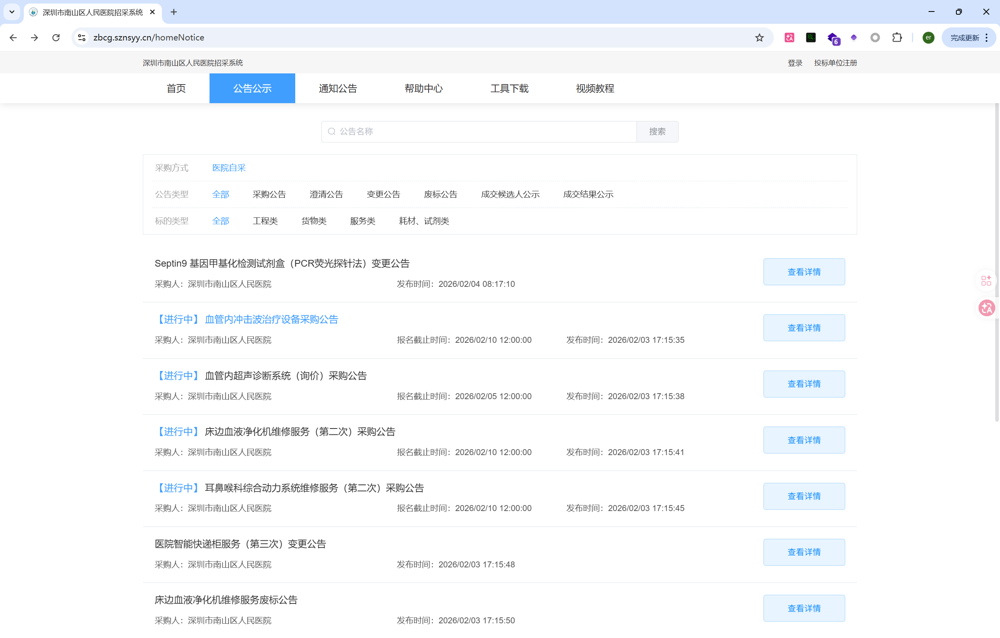
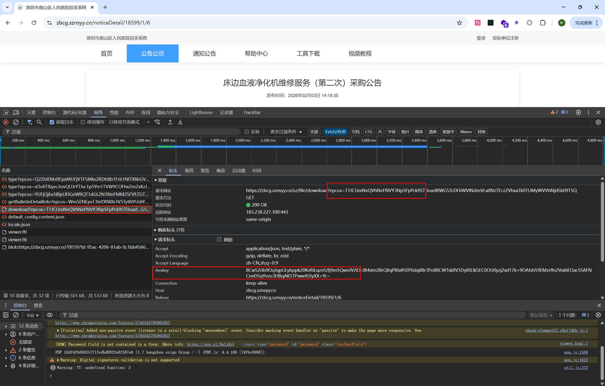
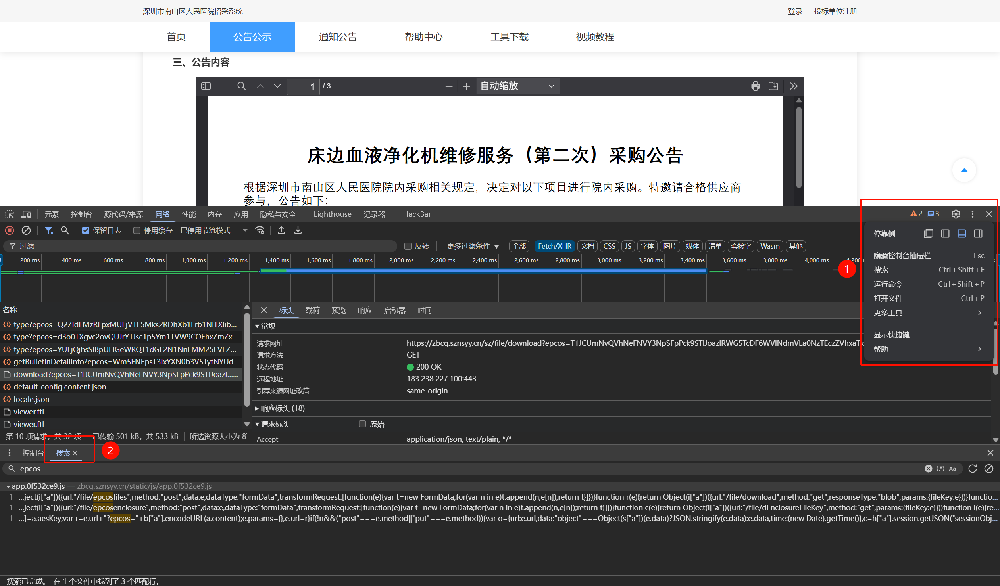
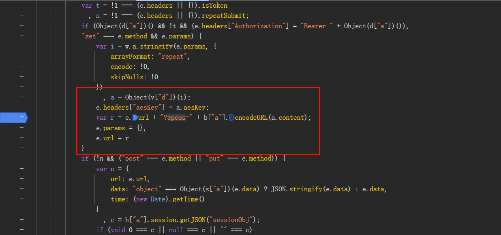
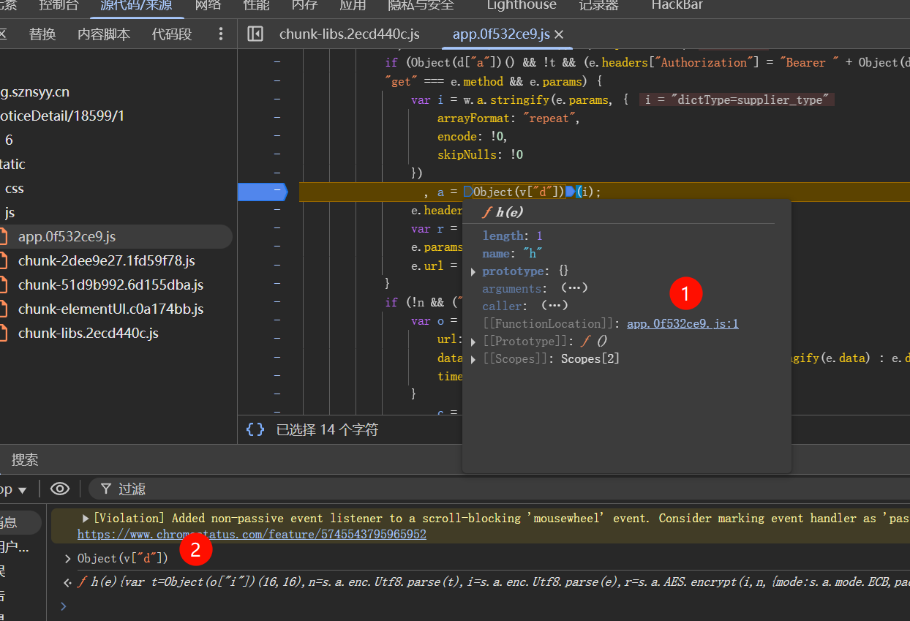
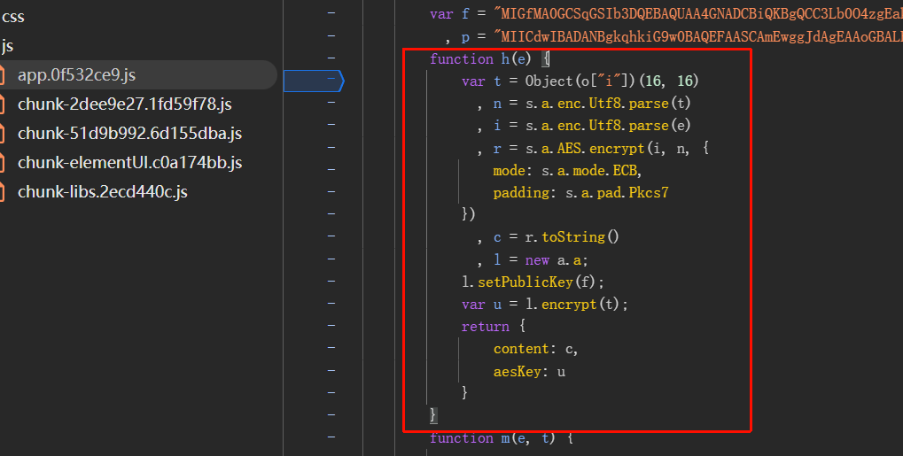
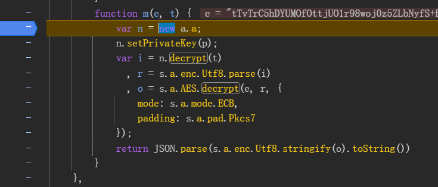
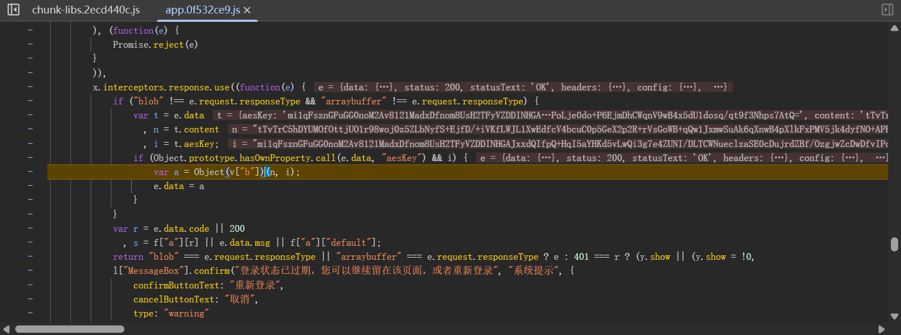
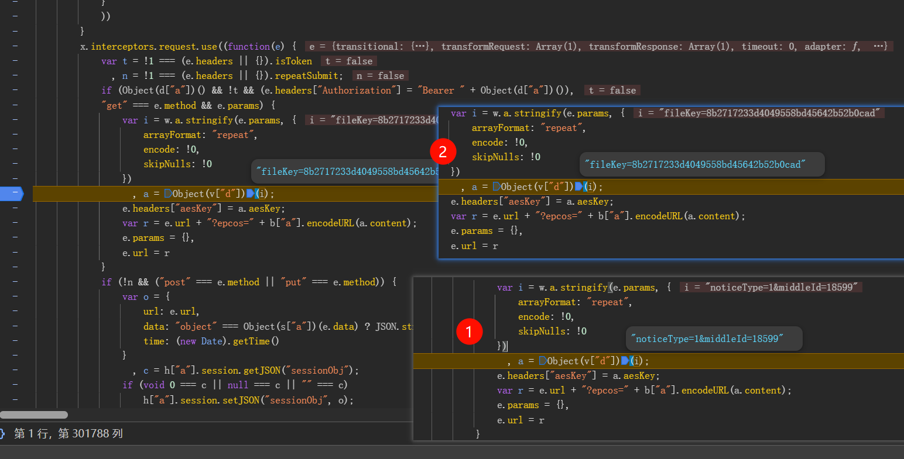
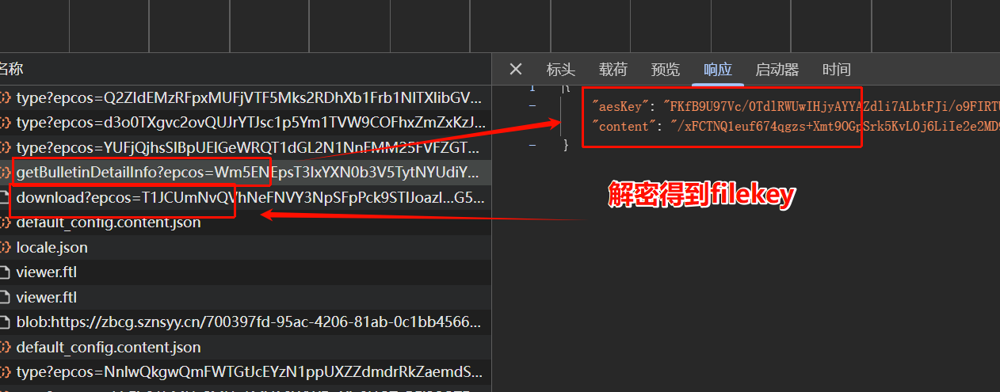

# 某统计招标网站aseKey,epcos参数逆向
## 抓包分析


```aiignore
响应返回PDF文件
直接访问下载链接：https://zbcg.sznsyy.cn/sz/file/download?epcos=T1JCUmNvQVhNeFNVY3NpSFpPck9STlJoazlRWG5TcDF6WVlNdmVLa0NzTEczZVhxaTk0TUMyWVVhNjdSb09TSQ
会显示参数秘钥错误
因为前面还会加载一个aesKey，用于生成filekey
```

## 逆向分析
### 定位加密位置

只有三个结果，第三个是epcos参数位置

```aiignore
请求参数aesKey -> 通过a.aeskey获得
epcos -> 提取a中content -> 通过b["a"].encodeURL(a.content)生成
所以先观察a
```
### 断点调试分析
下好断点，等断点断在这，进入函数的两种方法

接下来一步步扣代码到js文件，调用函数，右键运行，缺啥补啥

### 扣代码还原js加密

### 定位解密位置
搜索decrypt


### 扣代码还原js解密

## Python模拟发送请求


```aiignore
两次请求：
    第一次请求：https://zbcg.sznsyy.cn/sz/purchaser/public/getBulletinDetailInfo?epcos=
    - 传入参数：noticeType=1&middleId=18601,得到epcos发送请求
    - 响应数据：密文和aesKey(解密后得到fileKey参数)
    
    第二次请求：https://zbcg.sznsyy.cn/sz/file/download?epcos=
    - 传入参数：fileKey,得到epcos发送请求
    - 响应数据：PDF文件
```
